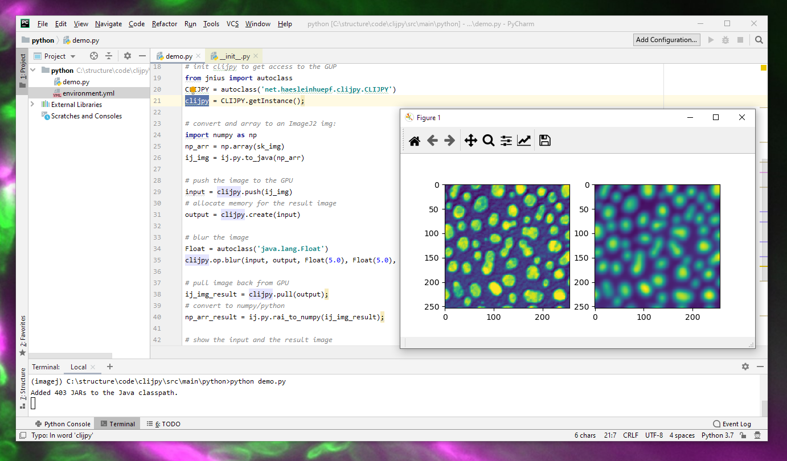

# CLIJPY
CLIPY is a bridge between [CLIJ](https://clij.github.io) and [python](https://python.org) via [pyimagj](https://pypi.org/project/pyimagej/)



Right now, this is very preliminary.

## Installation
Download [python](https://python.org), install [pyjnius](https://pyjnius.readthedocs.io/en/stable/installation.html#) and [pyimagej](https://pypi.org/project/pyimagej/):

### Installation on Windows 10:
```bash
set PATH=%PATH%;C:\Program Files\Java\jdk1.8.0_161\jre\bin\server
copy "C:\Program Files\Java\jdk1.8.0_161\include\win32\jni_md.h" c:\ProgramData\Anaconda3\Library\include
python -m pip install --upgrade pip setuptools
python -m pip install --upgrade cython
pip install pyjnius
pip install pyimagej

set "JDK_HOME=C:\Program Files\Java\jdk1.8.0_161\"

pip install jnius

# get the environment.yml file from: https://raw.githubusercontent.com/imagej/pyimagej/master/environment.yml
conda env create -f environment.yml

conda activate imagej

pip install pyimagej
pip install scikit-image
pip install scipy
pip install numpy
pip install matplotlib
```

Download and install [Fiji](https://fiji.sc) and activate the clij update site as [described here](https://clij.github.io/clij-docs/installationInFiji). 
Furthermore, download the following jar files and put them in the `plugins` directory of your Fiji installation

the following files and put them all in a folder:
* [clijpy-0.1.0.jar](https://github.com/clij/CLIJPY/releases/download/0.1.0/clijpy-0.1.0.jar)
* [clij-advanced-filters_-0.6.2.jar](https://github.com/clij/clij-advanced-filters/releases/download/0.6.2/clij-advanced-filters_-0.6.2.jar)

## Example code
Examples are available in the [python](https://github.com/clij/clijpy/blob/master/src/main/python/) folder. 

After installation, you can call the examples like this:

```bash
conda actiavte imagej
python demo.py
```

## How to develop clijpy
Clone this repository 

```bash
git clone https://github.com/clij/CLIJPY
```

Enter the location of your Fiji installation in the pom.xml:

```xml
<properties>
    <imagej.app.directory>C:/programs/fiji-win64/Fiji.app/</imagej.app.directory>
</properties>
```
Build it using maven. 

```bash
cd clijpy
mvn install
```


## Please note
It is recommended to [use clij from Fiji](https://clij.github.io/clij-docs/installationInFiji). 
Python support is under development.

[Back to CLIJ documentation](https://clij.github.io/)
